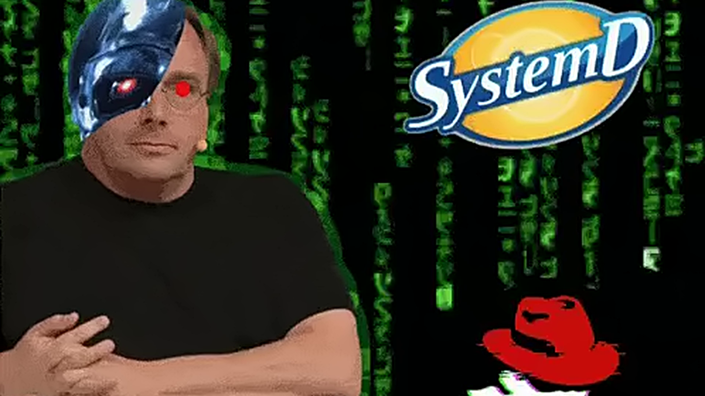

# Systemd Linus Terminator Theme



> In the year 20XX, the machines became self-aware. Their first act was to replace PID 1. Their second was to send a half-man, half-kernel Linus back through a six-second VHS time loop to stop a sentient Red Hat before it could finish booting. The Matrix is leaking through the desktop, the SystemD logo has achieved orbital dominance, and every time the footage ends it immediately starts again. There is no escape. There is only `systemctl restart reality`.

An **Omarchy theme** with a cold cyan palette and a silent, endlessly looping 1920×1080 video wallpaper. The image above is the still used for the lock screen and theme transitions; the moving version is [video/wallpaper.mp4](video/wallpaper.mp4).

## Install

Requires Omarchy, a Wayland session, Git, and `mpvpaper`. Clone it rather than using `omarchy theme install`: that command does not install the hooks needed to play the video.

```bash
git clone https://github.com/1818TusculumSt/systemd-linus-terminator-theme.git
cd systemd-linus-terminator-theme
omarchy pkg add mpvpaper
./install
```

`./install` links this checkout at `~/.config/omarchy/themes/systemd-nostalgia`, installs `theme-set` and `post-boot` hooks, and applies the theme. The Omarchy theme slug remains **systemd-nostalgia** (the repository name is different).

- Changing to another theme stops this video; switching back or logging in with this theme active starts it.
- The video plays on connected monitors without a hardcoded output name. Audio is disabled.
- To update, run `git pull` in this checkout. Re-run `./install` only after moving the checkout.

## Remove

Switch themes first, then remove the two hooks and the theme link. Only remove the link if it still points at this checkout:

```bash
omarchy theme set <another-theme>
rm ~/.config/omarchy/hooks/{theme-set,post-boot}.d/systemd-nostalgia-wallpaper
readlink ~/.config/omarchy/themes/systemd-nostalgia
rm ~/.config/omarchy/themes/systemd-nostalgia
```

The video lives in this repository, so deleting the checkout after removal deletes the media too.
